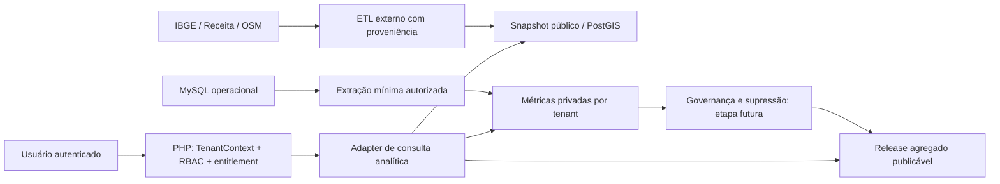

# Central Intelligence — pesquisa de mercado e tecnologia

Data da consulta: **02/10/2026** · Piloto: **Imperatriz/MA** · Escopo: pesquisa documental exploratória com fontes públicas e documentação de fornecedores.

Não foram realizadas entrevistas, contagem completa de concorrentes, coleta de transações, avaliação presencial de bairros ou cotação comercial. As recomendações são inferências de planejamento, não resultados locais já calculados. Páginas de fornecedores descrevem suas próprias ofertas; não constituem comparação independente de desempenho.

## 1. Parecer de viabilidade

A proposta é tecnicamente viável por etapas. O ponto de entrada recomendado é um **mapa de oferta e contexto demográfico**, com indicadores transparentes de potencial. Há insumos públicos para experimentar em Imperatriz; sua cobertura local e qualidade ainda precisam ser medidas. “Demanda alta”, “potencial de consumo em reais” e “maior movimento por horário” exigem outras evidências.

A tese comercial a validar é a combinação de gestão veterinária com inteligência territorial acessível na mesma rotina. Geomarketing já existe como categoria; o projeto não deve alegar exclusividade. A rede de usuários pode enriquecer o produto, mas uma base pequena não sustenta benchmark seguro nem representativo.

## 2. Mercado e alternativas

### Dimensão do setor

A ABEMPET informa faturamento brasileiro de **R$ 75,4 bilhões em 2024**, crescimento de **9,6%** sobre 2023; serviços veterinários representam R$ 7,7 bilhões nessa publicação. São dados históricos nacionais da entidade, não estimativa de receita de software nem de Imperatriz. O mercado total inclui várias atividades fora do cliente-alvo do Central Vet. Não multiplicar população local por esse total para estimar demanda municipal. [Fonte: ABEMPET — informações do setor](https://abempet.org.br/informacoes-gerais-do-setor/).

A página de dados da associação informa a união de Abinpet e Instituto Pet Brasil desde 2025 e apresenta acesso a estudos/releases pelo PetHub. Isso indica uma possível fonte futura de estudos, sujeita a acesso e direitos de uso; não foi confirmado um dataset aberto de consumo por bairro. Valores apresentados como projeção de 2025/2026 em releases não foram tratados aqui como faturamento realizado. [Fonte: ABEMPET — dados de mercado](https://abempet.org.br/dados-de-mercado/).

### Comparação das ofertas consultadas

| Alternativa | Evidência da oferta | Implicação para o Central Vet |
|---|---|---|
| SimplesVet | Gestão com agenda, prontuário, vendas/estoque e funções para negócios pet na página oficial indexada | Operação integrada é expectativa do segmento; o mapa precisa acrescentar uma decisão útil |
| Cortex/Geofusion | Inteligência geográfica e integração de dados externos e internos; evolução da antiga OnMaps | Concorrência horizontal para análise territorial; validar simplicidade e especialização pet |
| Urban Systems | Estudos de potencial de mercado e estratégia territorial para comércio, serviços e cidades | Alternativa consultiva para expansão; análises geográficas não são uma ideia inédita |
| Pesquisa manual e ferramentas cartográficas | Processo a investigar nas entrevistas, não concorrente quantitativamente medido | Pode ser o substituto real para pequenos empresários; preço e facilidade precisam superar esse processo |

Fontes diretas: [SimplesVet — funcionalidades](https://simples.vet/funcionalidades/), [Cortex — Geofusion](https://www.cortex-intelligence.com/blog/geofusion-agora-e-cortex), [Urban Systems](https://urbansystems.com.br/). O acesso direto à página do SimplesVet retornou HTTP 403 durante parte da consulta; sua descrição veio do resultado indexado da própria página. Ausência de uma funcionalidade nas páginas consultadas não comprova que o fornecedor não a oferece. Não foram feitos testes dos produtos.

**Inferência:** o posicionamento mais defensável é “gestão + diagnóstico territorial especializado no negócio pet”, com continuidade entre análise e operação. O mapa isolado terá substitutos fortes. Especialização significa categorias corretas, boa cobertura, indicadores explicáveis e ações próprias úteis — não apenas pins e texto de IA.

### Público e modelo comercial propostos

Começar com gestores que já tomam decisões sobre campanha local, portfólio ou expansão: clínicas estabelecidas, pet shops com banho e tosa e operações com mais de uma unidade. Para pequenos negócios, expansão física pode ser pouco frequente; validar utilidade recorrente em campanhas e mix de serviços.

Hipóteses a testar: complemento premium por tenant com cobertura de uma cidade; cobertura adicional por cidade; limites de consultas/exportações; pacote distinto para redes. Não cobrar por benchmark onde a amostra não permite entregá-lo. Preço, disposição de pagar e tamanho do mercado endereçável não foram demonstrados. Um TAM de software exige número de estabelecimentos elegíveis, taxa de adoção e ticket plausível; o faturamento pet nacional não responde a isso.

Plano de campo sugerido: entrevistas com 8–12 gestores e protótipo com três tarefas — encontrar regiões para campanha, comparar expansão e identificar lacuna de portfólio. Registrar decisão anterior, fonte usada, tempo gasto, valor percebido e compromisso de teste/pagamento. A validação deve incluir quem não abrirá filial em breve.

## 3. Imperatriz: o que foi confirmado

O IBGE identifica **Imperatriz como 2105302** e registra **273.110 habitantes no Censo 2022**. Esse dado descreve a população municipal naquele ano; não corresponde à população atual nem a população urbana de cada bairro. A aplicação deve preservar ano de referência e recorte. [Fonte: IBGE — Imperatriz](https://www.ibge.gov.br/cidades-e-estados/ma/imperatriz.html).

Há publicações municipais sobre cadastro técnico e georreferenciamento, mas isso não comprova disponibilidade pública de uma malha vetorial completa, atualizada e licenciada de bairros. O piloto deve solicitar/verificar limites adequados; na ausência deles, usar setores censitários ou agrupamentos identificados como tais. Não converter imagem de mapa ou endereço com bairro textual em limite oficial. [Fonte: Prefeitura — cadastro territorial](https://novo.imperatriz.ma.gov.br/noticias/fazenda-e-gestao/implantacao-de-cadastro-tecnico-permite-panorama-territorial-de-imperatriz.html).

Não foi calculado o número de clínicas, pet shops ou farmácias veterinárias locais. Não foi identificado um bairro com “demanda alta” nesta pesquisa. Essas conclusões dependem da ingestão, deduplicação, geocodificação e validação de campo.

## 4. Fontes e direitos de uso

| Fonte | Contribuição possível | Limites e providências |
|---|---|---|
| IBGE — malhas e agregados do Censo | População, domicílios e geometria de setores; contexto por região | Referência 2022, versões de malha compatíveis, dicionário e denominadores; não mede pets nem compras |
| IBGE — rendimento do responsável | Contexto econômico disponível no repositório de agregados | Não chamar de renda domiciliar per capita; verificar variáveis, cobertura local e regras de não disponibilidade |
| Receita Federal — estabelecimentos CNPJ | Categoria econômica, situação cadastral e endereço | Sem coordenadas no layout consultado; geocodificar, mapear código municipal, filtrar atividades principal/secundárias e validar funcionamento |
| OpenStreetMap | Pontos e geografia colaborativa | Cobertura desigual, deduplicação e atribuição; avaliar ODbL e licenças de bases derivadas |
| Prefeitura de Imperatriz | Eventuais bairros, logradouros e outros limites | Existência de projeto municipal não garante API/dataset público ou direito de reutilização |
| Central Vet — dados próprios | Distribuição regional, serviços realizados, horários e valores da própria operação | Qualidade, escopo, finalidade, base legal, sem extrapolação para todo o mercado |
| Fontes comerciais futuras | Mobilidade, consumo, pontos e estudos mais detalhados | Contrato, cobertura, metodologia, custo e direitos de armazenar/publicar/revender |

O diretório do IBGE disponibiliza agregados de rendimento do responsável e materiais de apoio, incluindo recortes por bairros. A existência do diretório não confirma preenchimento para todos os recortes de Imperatriz nem equivalência entre bairro estatístico e bairro municipal. Validar edição e documentação antes de qualquer cálculo. [Fonte: repositório IBGE](https://ftp.ibge.gov.br/Censos/Censo_Demografico_2022/Agregados_por_Setores_Censitarios_Rendimento_do_Responsavel/).

O layout público do CNPJ documenta arquivos de estabelecimentos, CNAEs, situação e campos de endereço. Para o mapa, selecionar somente campos necessários do estabelecimento; não importar QSA, CPF de sócios, telefones pessoais ou e-mails por conveniência. Definir tratamento de endereços de negócios domiciliados em residência antes de exibi-los. O endpoint de distribuição deve ser confirmado na CI-0; uma tentativa de acesso ao diretório de arquivos nesta pesquisa retornou 404. [Fonte: Receita Federal — metadados](https://www.gov.br/receitafederal/dados/cnpj-metadados.pdf).

### Categorias iniciais

| Categoria de análise | CNAE de partida |
|---|---|
| Atividades veterinárias | 7500-1/00 |
| Pet shop: animais/artigos/alimentos | 4789-0/04 |
| Higiene e embelezamento animal | 9609-2/08 |
| Medicamentos veterinários no varejo | 4771-7/04 |

Os códigos constam da classificação oficial consultada; a tabela detalhada usada é a versão 2.2 histórica. Validar correspondência com a versão vigente do arquivo importado. O CNAE é filtro inicial, não prova de serviços atualmente oferecidos: pet shops podem prestar banho e tosa e lojas agropecuárias podem vender medicamentos. Permitir categorias múltiplas, contar estabelecimento uma vez nos totais e revisar casos limítrofes. [Fonte: IBGE — CNAE, estrutura e notas](https://ftp.ibge.gov.br/Informacoes_Gerais_e_Referencia/Classificacoes/CNAE/cnae2_2/cnae2_2_subclasses_20150609.pdf).

## 5. Pesquisa tecnológica e escolha recomendada

### Mapa e distribuição

| Opção | Aplicação | Avaliação para o projeto |
|---|---|---|
| Leaflet | Mapa 2D, pontos e GeoJSON | Candidato inicial para uma cidade; confirmar desempenho com amostra real e clustering |
| MapLibre GL JS | Renderização WebGL com mapas vetoriais | Candidato para muitas feições e múltiplas cidades; adiciona pipeline de estilos/tiles |
| GeoJSON versionado | Snapshot de pontos/regiões públicos | Simples para protótipo pequeno; payload e atualização limitam escala |
| PMTiles | Arquivo de tiles em storage HTTP | Alternativa posterior; depende de Range requests/CORS e custo de egress |

As bibliotecas não fornecem automaticamente um mapa base, geocodificação ou dados de concorrentes. Fontes: [Leaflet](https://leafletjs.com/), [MapLibre GL JS](https://maplibre.org/maplibre-gl-js/docs/), [PMTiles — conceitos](https://docs.protomaps.com/pmtiles/).

Dados OSM são licenciados sob ODbL; atribuição e obrigações de banco derivado precisam ser analisadas conforme a combinação e publicação. Separar fontes por proveniência não elimina obrigações de licença. Não mesclar automaticamente dados privados numa base redistribuível. [Fonte: OSM — licença](https://www.openstreetmap.org/copyright).

O serviço público de tiles OSM tem regras de cache, identificação e atribuição, e proíbe downloads em massa/prefetch. Não tratá-lo como infraestrutura comercial ilimitada. Para produção, selecionar fornecedor contratado ou hospedagem própria adequada ao volume. [Fonte: política de tiles OSM](https://operations.osmfoundation.org/policies/tiles/).

O Nominatim público limita requisições a no máximo uma por segundo, restringe usos pesados e não permite autocomplete no cliente. Para geocodificação recorrente de cadastros, preferir serviço contratado ou instância própria; limites e cache variam por provedor. Não disparar geocodificação de toda a Receita a partir do PHP da aplicação. [Fonte: política Nominatim](https://operations.osmfoundation.org/policies/nominatim/).

### Armazenamento e processamento

Recomendação: manter **MySQL operacional**, com **pipeline analítico externo**. Para CI-2, executar ingestão por lote e publicar um snapshot íntegro de Imperatriz; consultas simples podem usar resultados pré-calculados. Quando volume/interatividade justificar, PostgreSQL/PostGIS dedicado fornece consultas por polígonos e índices espaciais. A hospedagem atual não obriga nem viabiliza automaticamente instalar esse serviço.

PostGIS possui predicados como `ST_Intersects`, `ST_Within` e `ST_DWithin` que aproveitam índices espaciais em consultas adequadas. Pontos na borda e regiões sobrepostas exigem regra explícita de atribuição. Distâncias devem usar um CRS métrico apropriado ou `geography`; longitude/latitude em graus não são metros. Escolher e testar CRS a partir das fontes. [Fonte: PostGIS — consultas espaciais](https://postgis.net/docs/using_postgis_query.html).

Python/GeoPandas é candidato para ETL de malhas e junções espaciais. Rodar fora do request PHP e fixar versões estáveis após a prova técnica; exemplos da documentação podem apontar para versões de desenvolvimento. Não há necessidade inicial de Kafka, data lake complexo, H3, machine learning ou atualização em tempo real. [Fonte: GeoPandas — junções](https://geopandas.org/en/stable/docs/user_guide/mergingdata.html).

Fluxo proposto:

A conexão entre MySQL e extração não concede acesso do cliente ao banco. Dados privados não entram no snapshot público. Serviços internos têm autenticação própria e escopo validado. Preservar as ADRs existentes e a autorização de migrations; este relatório não aplica nenhuma alteração de banco.

### Ingestão proposta para Imperatriz

1. Registrar fontes, edição, licença, frequência e checksum; baixar malha e dicionários compatíveis.
2. Recortar município/área urbana conforme geometria e classificação adequadas, sem comparar densidade rural com urbana como se fossem iguais.
3. Filtrar estabelecimentos por município e CNAE principal/secundário; mapear códigos municipais entre fontes.
4. Normalizar endereços; geocodificar por lote com contrato e precisão registrados. Separar número, rua, CEP, município e bairro textual.
5. Deduplicar CNPJ de estabelecimento quando disponível; em demais casos combinar nome/endereço/proximidade com revisão. Não fundir filiais distintas só por nome.
6. Associar pontos a polígonos validados; evitar falsa precisão e registrar pontos não atribuídos.
7. Calcular indicadores e cobertura; auditar amostra antes de publicar. Publicar nova versão atomicamente e preservar a última íntegra.
8. Medir tempo, custo, erros e atualização; monitorar mudanças de fonte/licença e regressões de cobertura.

Para dados próprios, começar com extração incremental controlada e reconciliação. Comparar watermark com outbox transacional na CI-1: watermark simples pode perder exclusões e correções sem protocolo adicional; outbox exige implementação e operação próprias. Não assumir Redis/workers distribuídos disponíveis no cPanel. Nenhum processo dessa lista foi executado nesta pesquisa.

## 6. Indicadores: como não confundir hipótese com evidência

| Indicador | Fonte necessária | Interpretação permitida |
|---|---|---|
| Oferta por categoria | POIs deduplicados com cobertura validada | Oferta cadastrada nas fontes, não total garantido de concorrentes |
| Contexto demográfico | População/domicílios e limites coerentes | Perfil territorial do ano de referência |
| Contexto de renda | Variável IBGE com definição exata | Proxy econômico; não gasto pet nem ticket possível |
| Potencial relativo | Método transparente, cobertura suficiente | Estimativa comparativa dentro do piloto |
| Serviços e horários próprios | Atendimentos/vendas válidos da organização | Comportamento observado da empresa |
| Preferência regional observada | Amostra representativa e categorias compatíveis | Comportamento da amostra, com limites claros |
| Fluxo horário externo | Fonte licenciada de mobilidade/contagem | Apenas o fenômeno medido e o recorte do contrato |
| Consumo agregado | Dados com direitos, qualidade e governança | Produto agregado elegível, sem revelar empresas/clientes |

Para o primeiro índice, avaliar percentis de população/domicílios e contexto de renda, juntamente com oferta por categoria e denominador consistente. A fórmula, os pesos e os cortes ficam pendentes de CI-0; não criar pesos arbitrários como se fossem validados. Exibir componentes antes do score. Se a cobertura dos concorrentes for baixa, um índice que premia pouca concorrência produzirá falsos positivos e deve ser suspenso.

Mesmo com fórmula válida, oportunidade depende de aluguel, acesso, porte do negócio, capacidade, deslocamento, concorrentes fora da borda e perfil de tutores. Distância em linha reta não equivale a tempo de deslocamento; isócronas precisam de serviço/algoritmo e dados viários adicionais.

### Google Maps e “horários de maior movimento”

Places pode ser uma integração contextual futura, mas suas políticas restringem armazenamento/cache de conteúdo; `place_id` possui exceção específica. Não usá-lo como base de concorrentes permanentemente exportável sem validar direitos e termos de exibição. [Fonte: políticas Places](https://developers.google.com/maps/documentation/places/web-service/policies).

A lista oficial de campos consultada inclui horários de abertura, mas não um campo de “popular times”. Portanto, não há suporte documentado nessa API consultada para prometer os horários populares exibidos no produto de consumo. Horário de abertura não mede movimento. Não planejar scraping como atalho; tratar fluxo externo como pesquisa/licenciamento separado. [Fonte: campos Places](https://developers.google.com/maps/documentation/places/web-service/data-fields).

## 7. Governança, rede e integrações financeiras

A LGPD distingue dados pessoais e anonimização, exige finalidade/base legal e considera meios razoáveis de associação/reversão. Na Intelligence, endereço de tutor e seus históricos vinculados exigem avaliação; dados cadastrais públicos podem continuar envolvendo pessoas naturais. O desenho e a operação devem passar por análise jurídica específica, sem presumir que interesse comercial ou adesão da clínica resolve todo o tratamento. [Fonte: LGPD, especialmente arts. 5º, 6º, 7º e 12](https://www.planalto.gov.br/ccivil_03/_ato2015-2018/2018/lei/l13709.htm).

A orientação técnica da ANPD reforça a necessidade de avaliar anonimização no contexto do tratamento. Hash ou retirada de nome é insuficiente como garantia. Controles recomendados: minimização; separação de finalidade/acesso; número mínimo de empresas e observações; dominância; recortes fixos; supressão complementar; teste por diferenças e subtração dos dados próprios; retenção; revisão periódica. Esses controles são propostas de engenharia, não certificação de anonimização. [Fonte: estudo ANPD](https://www.gov.br/anpd/pt-br/centrais-de-conteudo/documentos-tecnicos-orientativos/estudo_tecnico_sobre_anonimizacao_de_dados_na_lgpd___analise_juridica.pdf).

No piloto, poucas organizações podem tornar a camada de rede indisponível por inteiro. Preservar mapa público e visão própria como entregas independentes. Não publicar benchmark de preços individuais de concorrentes; qualquer comparação futura exige avaliação de confidencialidade e concorrência, além de privacidade.

Pix/cartão e Open Finance não são fontes abertas de consumo dos concorrentes. O compartilhamento bancário depende de consentimento do titular e participantes/serviços habilitados; isso não concede acesso geral ao mercado. Integrações futuras poderão reconciliar dados próprios autorizados ou usar estudos agregados contratados, após validação de cobertura, finalidade e direitos de publicação. [Fonte: Banco Central — Open Finance](https://www.bcb.gov.br/meubc/faqs/s/open-finance).

## 8. Custo, operação e prova técnica

Não foi obtida cotação. Bibliotecas abertas não tornam hospedagem, dados, geocodificação e suporte gratuitos. O custo mensal deve ser calculado como:

`infraestrutura analítica + storage/backups + tiles/egress + geocodificações + licenças de dados + monitoramento + operação/suporte`.

Medir sessões de mapa, tiles por sessão, cache hit, número de novos endereços e atualizações, volume de snapshots, frequência de ETL e consultas por escopo. Fixar teto mensal e alertas por fornecedor. Escolha entre SaaS de dados, serviço gerenciado ou VPS depende de licença, capacidade de operar e orçamento; não há cotação que permita concluir qual é mais barato agora.

Prova técnica proposta para CI-0/1:

- Amostra auditada sugerida de 30–50 estabelecimentos, ou toda a base caso menor, estratificada por categoria e região. Registrar existência, atividade, duplicidade, endereço e precisão. É proposta de amostragem, não auditoria realizada.
- Verificar disponibilidade real de variáveis e polígonos para Imperatriz; testar junção espacial e incompatibilidade entre edições.
- Comparar Leaflet/GeoJSON com MapLibre apenas se a carga justificar; medir payload, interação mobile e acessibilidade.
- Validar adapter PHP com TLS, timeout, escopo, cache e falha isolada; testar dois tenants na etapa de dados privados.
- Simular inferência por zoom, filtros, períodos e subtração própria antes da rede; suprimir quando falhar.
- Produzir orçamento medido e registrar fornecedor/licença; reestimar pessoa-semana após a amostra.

**Recomendação final de planejamento:** investir primeiro em validação local e qualidade dos dados; lançar CI-2 somente se o mapa ajudar uma decisão real. Preparar interfaces e governança agora, mantendo pesada ingestão e análise fora da hospedagem operacional. Evoluir consumo e rede quando houver evidência, escala e direitos suficientes.

Documentos associados: [plano atualizado](../plan/centralvet-roadmap.md), [PRD](../prd/central-intelligence.md) e [ADR proposta](../../docs/architecture/adr/0004-central-intelligence-analytical-boundary.md).
